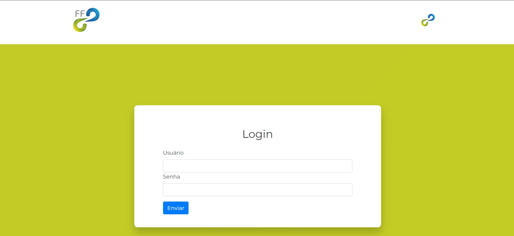
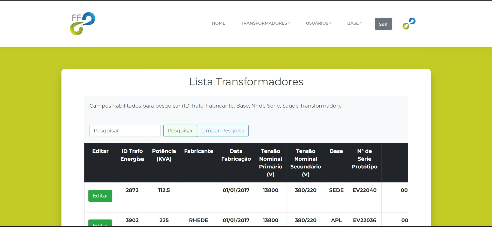
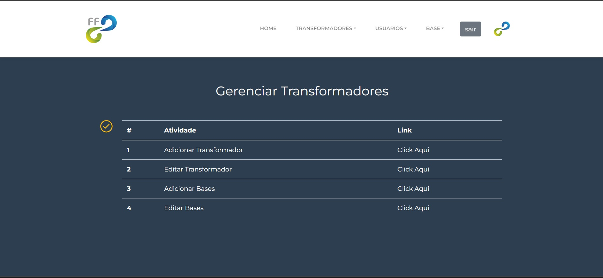
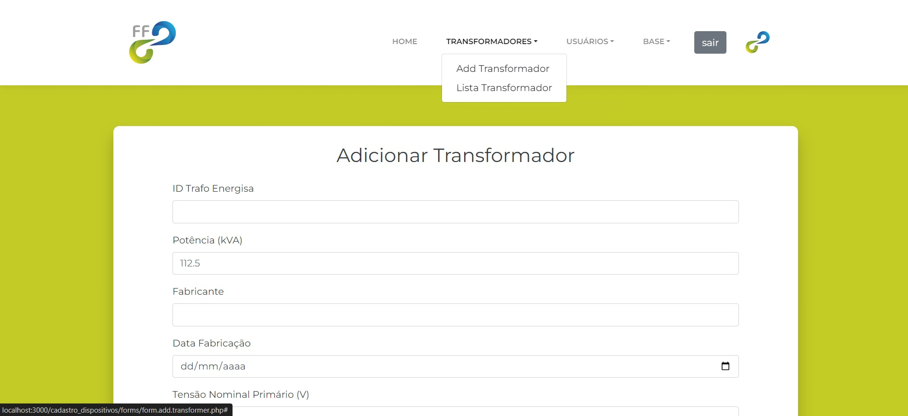

# Add_transformers_php

* Este projeto foi desenvolvido em php, html, css e mysql. Para adicionar e gerenciar dispositivos em campo.
* O sistema possui login;
* O banco de dados encontra-se na pasta mysql, com dados para teste;

## Login

* Para login de teste utilizar:
    * Usuario: admin@admin.com
    * Senha: admin

## Imagens do Projeto

  

  
  
  

  